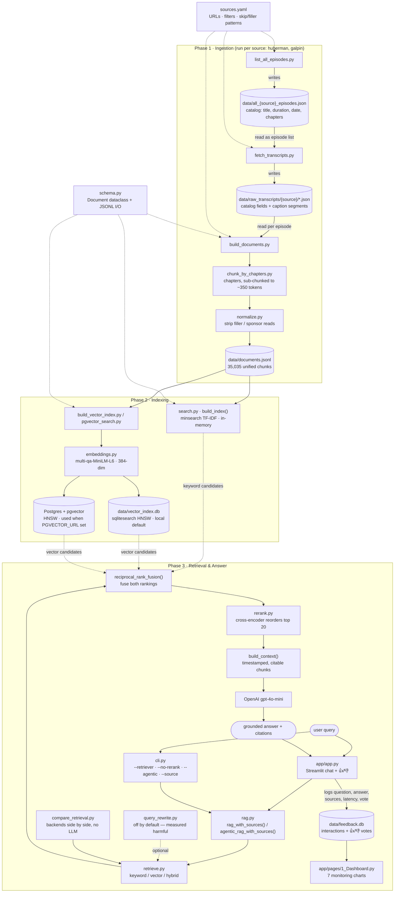

# Pipeline: from YouTube to a grounded answer

End-to-end flow of the health/performance RAG, in three phases:
**Ingestion** (build the knowledge base) → **Indexing** (make it searchable) →
**Retrieval & Answer** (query it). Each step's output is the next step's input.

> Preview this diagram in VSCode's Markdown preview (⇧⌘V) or on GitHub — both render Mermaid.

---

## Phase 1 · Ingestion

Turns YouTube channels into a clean, unified set of text chunks. Run the three steps
**in order, per source** — each is resumable, so interrupted runs continue where they stopped.

| # | Step | Reads | Writes | What it does |
|---|---|---|---|---|
| 1 | [list_all_episodes.py](../ingestion/list_all_episodes.py) | `sources.yaml` | `data/all_{source}_episodes.json` | Catalogs every video on the channel with title, duration, upload date, and **chapters** (creator markers). Filters out shorts by duration and (optionally) old episodes. |
| 2 | [fetch_transcripts.py](../ingestion/fetch_transcripts.py) | the catalog above | `data/raw_transcripts/{source}/*.json` | For each cataloged video, pulls the caption transcript via `youtube-transcript-api` and merges it with the catalog metadata (so each file carries **chapters + caption segments**). |
| 3 | [build_documents.py](../ingestion/build_documents.py) | the raw transcripts | `data/documents.jsonl` | Orchestrates chunking + normalization + schema, producing the single knowledge-base file all retrieval reads from. |

**Step 3 internals** (per episode, per chunk):

1. [chunk_by_chapters.py](../ingestion/chunk_by_chapters.py) `chunk_transcript()` — groups caption
   segments by chapter, then **sub-chunks each chapter into ~350-token overlapping windows**
   (a whole chapter is too coarse to retrieve well — see [evaluation.md](evaluation.md)). Every
   sub-chunk keeps its `chapter_title` and gets its own start/end timestamps. Sponsor/outro
   chapters are dropped by title pattern (`skip_chapter_patterns` in `sources.yaml`). The same
   windowing helper serves the fallback for chapter-less episodes.
2. [normalize.py](../ingestion/normalize.py) `normalize()` — strips in-text filler / sponsor reads
   (`filler_text_patterns` in `sources.yaml`) via a sliding segment window. Empty chunks are skipped.
3. [schema.py](../schema.py) `Document` — each chunk becomes a `Document` with a stable id
   `{source}_{video_id}_{chapter_index}_{sub_index}`, plus a `parent_chunk_id` naming the chapter
   it came from (this is what keeps evaluation ground truth valid across re-chunks);
   `save_documents()` writes them as JSONL.

## Phase 2 · Indexing

Two independent search backends are built over the **same** `documents.jsonl`. They're used
together at query time (hybrid), but each is also selectable alone as a baseline.

| Backend | Built by | Storage | Notes |
|---|---|---|---|
| **Keyword** (Module 1) | [search.py](../rag/search.py) `build_index()` | in-memory, rebuilt each process start | `minsearch` TF-IDF over `text`/`title`/`chapter_title` with boosts. Indexes the **full** chunk text. |
| **Vector** (Module 2) | [build_vector_index.py](../rag/build_vector_index.py) → [embeddings.py](../rag/embeddings.py) → [vector_search.py](../rag/vector_search.py) | `data/vector_index.db`, **persisted** (reopens without re-embedding) | `sqlitesearch` HNSW over local 384-dim embeddings. Since Module 6's sub-chunking, every chunk fits the model's 512-token window — nothing is truncated. |

> Rebuild rule: after `documents.jsonl` changes, the keyword index refreshes automatically
> (it's in-memory), but the vector `.db` must be rebuilt:
> `rm data/vector_index.db && uv run rag/build_vector_index.py`.

## Phase 3 · Retrieval & Answer

| Component | Role |
|---|---|
| [app/app.py](../app/app.py) | Streamlit chat UI — the primary interface. Renders the answer with clickable timestamp citations, exposes every retrieval approach in the sidebar (defaults = the eval winners), and collects 👍/👎. Heavy singletons sit behind `@st.cache_resource`, since Streamlit re-runs the script on every interaction. |
| [app/feedback.py](../app/feedback.py) | Logs each interaction (question, answer, sources, config, latency, vote) to `data/feedback.db` (SQLite). |
| [app/pages/1_Dashboard.py](../app/pages/1_Dashboard.py) | Monitoring dashboard — 7 charts over the interaction log. Reflects real usage only; never seeded. |
| [cli.py](../rag/cli.py) | Alternative entry point. Flags: `--retriever {keyword,vector,hybrid}`, `--no-rerank`, `--agentic`, `--source`, `--num-results`. |
| [rag.py](../rag/rag.py) | `rag()` = retrieve → stuff context → one LLM call. `agentic_rag()` = LLM calls `search` as a tool, reformulating queries, until it answers. |
| [retrieve.py](../rag/retrieve.py) | Backend-agnostic dispatch + the Module 6 stages. `hybrid` (default) fuses keyword and vector rankings with `reciprocal_rank_fusion()`; `rerank=True` (default) then reorders the top candidates. All backends return the same flattened dict shape, so `rag.py` never touches one directly. Indexes are lazily opened once per process. |
| [rerank.py](../rag/rerank.py) | Cross-encoder second pass — reads query and chunk *together* to score them, far more accurate than comparing pre-computed representations. Runs only over the ~20 retrieved candidates, since it's too slow for the full corpus. Local and free. |
| [query_rewrite.py](../rag/query_rewrite.py) | Optional LLM rewrite of the query before retrieval. **Off by default** — it measurably lowered accuracy here ([evaluation.md](evaluation.md)). |
| `build_context()` (in `rag.py`) | Formats retrieved chunks into a citable block with episode title, chapter, and a `&t=<seconds>s` deep link. |
| OpenAI `gpt-4o-mini` | Answers using **only** the supplied context (system prompt forbids outside knowledge); cites episode + timestamp, or says "I don't know." |
| [compare_retrieval.py](../rag/compare_retrieval.py) | Diagnostic: runs sample queries through the backends and prints top-k side by side (no LLM calls). |

**Query lifecycle:** `query → cli.py → rag.py → retrieve.py → (keyword + vector) → RRF fusion → cross-encoder re-rank → build_context() → OpenAI → grounded answer`.

---

## Cross-cutting

- **[sources.yaml](../ingestion/sources.yaml)** — the only place channel URLs, filter defaults, and
  skip/filler patterns live. Adding a source = one YAML entry + a new value in `schema.py`'s
  `source` Literal. No script edits.
- **[schema.py](../schema.py)** — the `Document` contract every chunk conforms to, and the JSONL
  reader/writer shared by ingestion (write) and indexing (read).

## Module status (LLM Zoomcamp)

The pipeline above covers **Modules 1 (Agentic RAG)**, **2 (Vector Search)**, **4 (Evaluation)**,
**5 (Monitoring)**, **6 (Best Practices — sub-chunking, hybrid, re-ranking, query rewriting)**,
and the interface half of **7**, all ✅ built. Still ahead: containerization (docker-compose) and
optionally orchestration (Airflow — earns no additional rubric points, since ingestion already
scores full marks as automated Python scripts). See the Build
sequence table in [CLAUDE.md](../CLAUDE.md).
