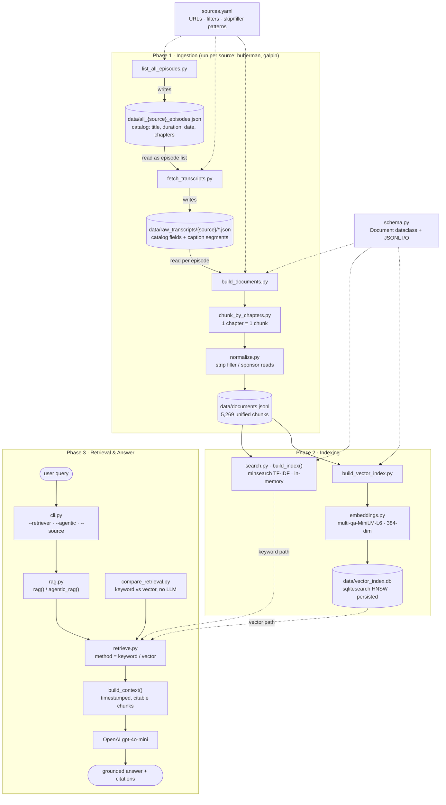

# Pipeline: from YouTube to a grounded answer

End-to-end flow of the health/performance RAG, in three phases:
**Ingestion** (build the knowledge base) → **Indexing** (make it searchable) →
**Retrieval & Answer** (query it). Each step's output is the next step's input.

> Preview this diagram in VSCode's Markdown preview (⇧⌘V) or on GitHub — both render Mermaid.

---

## Phase 1 · Ingestion

Turns YouTube channels into a clean, unified set of text chunks. Run the three steps
**in order, per source** — each is resumable, so interrupted runs continue where they stopped.

| # | Step | Reads | Writes | What it does |
|---|---|---|---|---|
| 1 | [list_all_episodes.py](../ingestion/list_all_episodes.py) | `sources.yaml` | `data/all_{source}_episodes.json` | Catalogs every video on the channel with title, duration, upload date, and **chapters** (creator markers). Filters out shorts by duration and (optionally) old episodes. |
| 2 | [fetch_transcripts.py](../ingestion/fetch_transcripts.py) | the catalog above | `data/raw_transcripts/{source}/*.json` | For each cataloged video, pulls the caption transcript via `youtube-transcript-api` and merges it with the catalog metadata (so each file carries **chapters + caption segments**). |
| 3 | [build_documents.py](../ingestion/build_documents.py) | the raw transcripts | `data/documents.jsonl` | Orchestrates chunking + normalization + schema, producing the single knowledge-base file all retrieval reads from. |

**Step 3 internals** (per episode, per chunk):

1. [chunk_by_chapters.py](../ingestion/chunk_by_chapters.py) `chunk_transcript()` — slices caption
   segments into **one chunk per chapter**, attaching `chapter_title` + start/end timestamps.
   Sponsor/outro chapters are dropped by title pattern (`skip_chapter_patterns` in `sources.yaml`).
   Token-window chunking is the fallback for chapter-less episodes.
2. [normalize.py](../ingestion/normalize.py) `normalize()` — strips in-text filler / sponsor reads
   (`filler_text_patterns` in `sources.yaml`) via a sliding segment window. Empty chunks are skipped.
3. [schema.py](../schema.py) `Document` — each chunk becomes a `Document` with a stable id
   `{source}_{video_id}_{chapter_index}`; `save_documents()` writes them as JSONL.

## Phase 2 · Indexing

Two independent search backends are built over the **same** `documents.jsonl`, so answers
can be compared keyword-vs-semantic.

| Backend | Built by | Storage | Notes |
|---|---|---|---|
| **Keyword** (Module 1) | [search.py](../rag/search.py) `build_index()` | in-memory, rebuilt each process start | `minsearch` TF-IDF over `text`/`title`/`chapter_title` with boosts. Indexes the **full** chunk text. |
| **Vector** (Module 2) | [build_vector_index.py](../rag/build_vector_index.py) → [embeddings.py](../rag/embeddings.py) → [vector_search.py](../rag/vector_search.py) | `data/vector_index.db`, **persisted** (reopens without re-embedding) | `sqlitesearch` HNSW over local 384-dim embeddings. ⚠️ Truncates chunks at 512 tokens — see the known limitation in [CLAUDE.md](../CLAUDE.md#chunking-strategy). |

> Rebuild rule: after `documents.jsonl` changes, the keyword index refreshes automatically
> (it's in-memory), but the vector `.db` must be rebuilt:
> `rm data/vector_index.db && uv run rag/build_vector_index.py`.

## Phase 3 · Retrieval & Answer

| Component | Role |
|---|---|
| [cli.py](../rag/cli.py) | Entry point. Flags: `--retriever {keyword,vector}`, `--agentic`, `--source`, `--num-results`. |
| [rag.py](../rag/rag.py) | `rag()` = retrieve → stuff context → one LLM call. `agentic_rag()` = LLM calls `search` as a tool, reformulating queries, until it answers. |
| [retrieve.py](../rag/retrieve.py) | Backend-agnostic dispatch: `method="keyword"` → `search()`, `method="vector"` → `vector_search()`. Both return the same flattened dict shape, so `rag.py` never touches a backend directly. Lazily builds/opens each index once per process. |
| `build_context()` (in `rag.py`) | Formats retrieved chunks into a citable block with episode title, chapter, and a `&t=<seconds>s` deep link. |
| OpenAI `gpt-4o-mini` | Answers using **only** the supplied context (system prompt forbids outside knowledge); cites episode + timestamp, or says "I don't know." |
| [compare_retrieval.py](../rag/compare_retrieval.py) | Diagnostic: runs sample queries through **both** backends and prints top-k side by side (no LLM calls). Seeds the Module 4 eval set. |

**Query lifecycle:** `query → cli.py → rag.py → retrieve.py → (keyword index | vector index) → build_context() → OpenAI → grounded answer`.

---

## Cross-cutting

- **[sources.yaml](../ingestion/sources.yaml)** — the only place channel URLs, filter defaults, and
  skip/filler patterns live. Adding a source = one YAML entry + a new value in `schema.py`'s
  `source` Literal. No script edits.
- **[schema.py](../schema.py)** — the `Document` contract every chunk conforms to, and the JSONL
  reader/writer shared by ingestion (write) and indexing (read).

## Module status (LLM Zoomcamp)

Phases 1–2 and the retrieval/answer loop cover **Modules 1 (Agentic RAG)** and **2 (Vector
Search)**, both ✅ built. Still ahead: orchestration (Airflow), evaluation (hit-rate/MRR +
LLM-as-judge), monitoring, hybrid search + reranking, and containerization. See the Build
sequence table in [CLAUDE.md](../CLAUDE.md).
